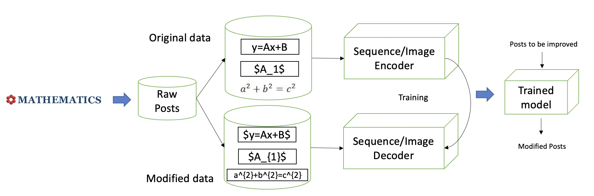

# Latexify Math: Mathematical Formula Markup Revision to Assist Collaborative Editing in Math Q&A Sites
Collaborative editing questions and answers plays an important role in quality control of Mathematics StackExchange which is a math Q&A Site. Our study of post edits in Mathematics Stack Exchange shows thatthere is a large number of math-related edits about latexifying formulas, revising LaTeX and convertingthe blurred math formula screenshots to LaTeX sequence. Despite its importance, manually editing onemath-related post especially those with complex mathematical formulas is time-consuming and error-proneeven for experienced users. To assist post owners and editors to do this editing, we have developed an edit-assistance tool,MathLatexEditfor formula latexification, LaTeX revision and screenshot transcription. Weformulate this formula editing task as a translation problem, in which an original post is translated to a revisedpost.MathLatexEditimplements a deep learning based approach including two encoder-decoder models fortextual and visual LaTeX edit recommendation with math-specific inference. The two models are trained onlarge-scale historical original-edited post pairs and synthesized screenshot-formula pairs. Our evaluation of MathLatexEditnot only demonstrates the accuracy of our model, but also the usefulness ofMathLatexEditin editing real-world posts which are accepted in Mathematics Stack Exchange.

## Details

As the foundation of science and engineering, mathematics has always been one of the most important subjects for students [27] among all levels of education. It can help reshape the students’reasoning, creativity, critical thinking and problem-solving abilities. On the other hand, mathematics is also one of the most challenging subjects for students [17,27,33]. Various mathematics communityQuestion and Answer (Q&A) sites have been developed. They provide a platform for students to ask about anything related to the mathematics with fast feedback from peers and experts. Mathematics Stack Exchange [7] is an example of such a Q&A site for people studying mathematics at any level and for professionals in related fields. Since its launch in 2010, it contains 1.3 million questions and 1.7 million answers from 661 thousand users [6]. To demonstrate our task, we first show some examples to illustrate what is the fundamental limitations in existing design sharing platforms.

However, the dramatic growth of posts and users on such Q&A sites poses a severe challenge to the quality assurance for site content. For example, some novice users may post questions and answers with grammar errors, misuse of abbreviations, blurred screenshots of formulas, and the lack of important information (e.g., context or referenced resources) for understanding questions and answers. Such quality deterioration can negatively influence the readability and understandability of posts, and may further discourage the participation of users [31]. To avoid the quality decay of the sites, Q&A sites like Mathematics Stack Exchange provide official recommendations for effective question writing [3] and answer writing [2].

Although all users are encouraged to follow the quality assurance policies, many users may still violate them carelessly or unintentionally, and some users may not even be aware of the existence of such policies. To ensure the site quality [32], Mathematics Stack Exchange encourages users,especially experienced users [8], to collaboratively edit the posts to make them comply with the site quality standards. According to our analysis in Section 3, among 2,886,174 posts including questions and answers (as of Mar 2020), 1,318,753 (45.69%) of them have been edited at least once. Post edits involve not only minor corrections of misspellings and grammar errors, but also math-related such as formatting math formula for better readability, fixing mathematical mistakes.Although collaborative editing is beneficial for the community [30], there are still three problems with such mechanism. First, it requires significant community effort, especially from high-reputation users to edit the posts directly and/or approve the edits by the other users. Second, some errors in the original posts, especially relatively complicated ones such as math formula errors or format are difficult to spot, as they may require a good understanding of the question or answer content. Third, all these collaborative edits are reactive to existing errors which may have already harmed the readers of the posts before edits, or made it difficult for those who want to help to answer the questions.

## EMPIRICAL STUDY 
We downloaded the latest data dump of Mathematics Stack Exchange which contains 2,886,174 posts (including 1,216,368 questions and 1,669,806 answers) and all post edits since its launch onJuly 20, 2010 to March 1, 2020. Based on this large dataset, we carried out an empirical study of post edits in Mathematics Stack Exchange to understand the characteristics of post editing inMathematics Stack Exchange and to motivate the required tool support.

##  RECOMMENDING LATEX EDITS BY DEEP NEURAL NETWORK
The three types of post edits related to math formula in our empirical study highlight the community efforts for ensuring the post quality in Mathematics Stack Exchange. Unfortunately, these effort sand revisions are implicit knowledge in millions of post edits. Considering the diversity of post editing types and contexts, it would require significant human effort to build a complete set of rules to deal with all different situations. Therefore, we developed a deep-learning based approach which can automatically improve the post editing patterns from historical post edits, and recommend edits to the new posts based on the learned editing knowledge.

The workflow of our approach is shown in Fig 1. Given three types of math-specific edit, we separate them into two tasks i.e., textual LaTeX edit (formula latexification,LaTeX revision) and visual LaTeXedit (screenshot transcription). Our approach first collected a large corpus of original-edited sentence pairs of modifying math formulas for subsequent textual LaTeX edit and synthesized a large corpus of image-formula pairs for model training for subsequent visual LaTeX edit. For textual LaTeX edits, our approach trained a transformer based model on a large parallel corpus of original-edited sentence pairs. For visual LaTeX edits, our approach adopted an encoder-decoder model for converting the formula screenshot to LaTeX representation based on synthesized image-formula pairs (Section 4.4). 

<!-- 
 -->

 

Fig. 1. Workflow of our approach

<!-- 
 -->
